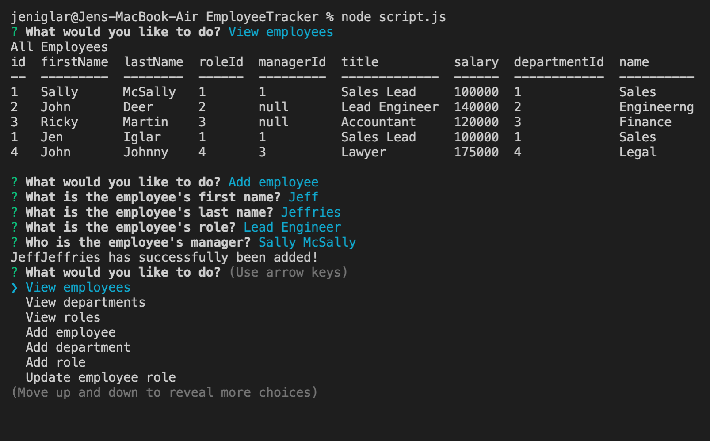

# Employee Tracker 

## Description 
I have created a command line Employee Tracker database designed  to be used in an office environment. This application allows a manager to easily keep track of all employees, departments, roles, and various other information. The manager may add, view, sort, and update employees by folowing the command line prompts. 

Video Demonstration: https://drive.google.com/file/d/12x3OjU6xhZoGW9qRCQRNkEwXSJ_OwUN5/view?usp=sharing

</>

## Table of Contents
- [Installation](#installation)
- [Usage](#usage)
- [License](#license)
- [Contributions](#contributions)
- [Tests](#tests)
- [Questions](#questions) 
  

## Installation
The user will need to have NPM installed prior to running the application.

## Usage
The user will run this application using node in their terminal. They will be prompted with a main menu of selections to start. They can view, add, and make updates to tables that store employee, department, and role information. 

## License
Notice: This is licensed under ISC.

## Contributions 
You may contribute to this application by forking the repository via my GitHub link below.

## Tests 
This application was run through multiple NPM tests.

## Questions
Please feel free to view my GitHub profile at https://github.com/jeniglar or email me directly at jeniglar@gmail.com with any additional questions.
